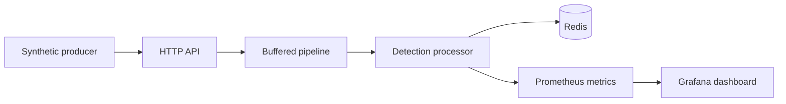
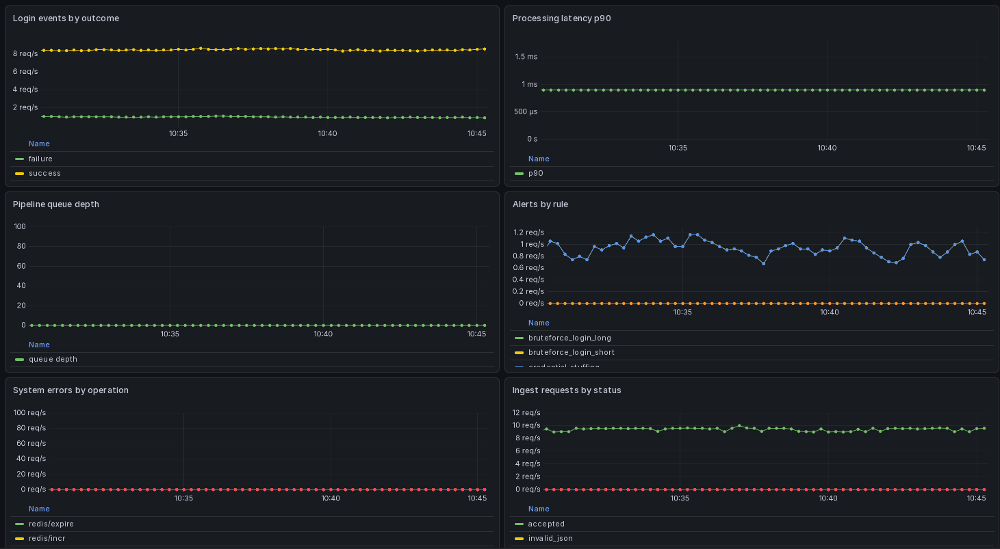

# LoginValidator


LoginValidator detects login abuse from auth events in near real time. It ingests events over HTTP, buffers them through an async pipeline, stores short-lived detection state in Redis, evaluates rule-based abuse patterns, and exports Prometheus metrics for Grafana.

## What it demonstrates
- real-time HTTP ingestion
- asynchronous pipeline processing
- Redis-backed state for detection windows
- Prometheus metrics and Grafana dashboards
- a single-command demo environment

## Architecture



The API returns `202 Accepted` for accepted auth events so ingestion stays fast and detection work remains asynchronous.

## Detection Rules

- `rapid_successful_login`: counts unique source IPs for a user in a Redis set keyed by `successful_login:<user_id>`.
- `bruteforce_login_short`: counts failed attempts per source IP with a Redis counter keyed by `bruteforce_login_short:<source_ip>`.
- `bruteforce_login_long`: counts failed attempts per source IP with a Redis counter keyed by `bruteforce_login_long:<source_ip>`.
- `credential_stuffing`: counts distinct users targeted by a source IP in a Redis set keyed by `ip_targets:<source_ip>`.

All rules use TTLs so the state expires automatically after the configured window.

## Event Schema

The ingestion endpoint expects JSON with these fields:

- `event_id`: UUID identifying the event
- `event_type`: event kind, currently `auth` is processed
- `outcome`: `success` or `failure`
- `user_id`: user identifier
- `source_ip`: client IP address
- `user_agent`: client user agent string
- `timestamp`: RFC3339 timestamp

Validation behavior:

- non-`POST` requests return `405 Method Not Allowed`
- invalid JSON returns `400 Bad Request`
- non-`auth` events are accepted with `202 Accepted` and ignored by detection
- full pipeline buffers return `429 Too Many Requests`

## Easiest install
If Docker is available, this is the fastest path:

```bash
docker compose up --build
```

That starts:

- Redis
- the LoginValidator API on `http://localhost:8080`
- Prometheus metrics on `http://localhost:2112/metrics`
- Prometheus on `http://localhost:9090`
- Grafana on `http://localhost:3000` with `admin` / `admin`
- a synthetic producer that generates demo traffic

## Local helper commands
For a slightly nicer local workflow, use `make`:

```bash
make test
make up
make demo-load
make down
```

Targets:

- `make test` runs the Go test suite
- `make up` starts the Docker Compose stack
- `make demo-load` runs the synthetic producer locally
- `make down` stops the stack

## What to look for
The demo is most useful when you watch the system in motion:

1. Start the stack.
2. Open Grafana.
3. Let the producer run.
4. Watch detection metrics move.

## Smoke test
After the stack is up, send one auth event:

```bash
curl -i -X POST http://localhost:8080/events \
  -H 'Content-Type: application/json' \
  -d '{"event_id":"7fe23cfc-62d7-40ea-b80b-721c37b137ad","event_type":"auth","outcome":"success","user_id":"user_1","source_ip":"192.0.2.10","user_agent":"Mozilla/5.0","timestamp":"2026-05-04T12:00:00Z"}'
```

Expected result:

- HTTP `202 Accepted`
- the event is accepted by the ingestion endpoint

## Grafana overview



If you only want one screenshot asset in the repo, keep `docs/login-validator-overview.png` as the canonical copy.

## Environment variables
The app reads these variables:

- `LOGIN_VALIDATOR_REDIS_ADDR`
- `LOGIN_VALIDATOR_HTTP_ADDR`
- `LOGIN_VALIDATOR_METRICS_ADDR`
- `LOGIN_VALIDATOR_RULES_PATH`
- `LOGIN_VALIDATOR_PRODUCER_URL`

## Test story
The tests are split into two useful layers:

- a smoke test that covers HTTP ingest through Redis side effects
- focused unit tests for JSON handling, rule loading, and detection behavior

## Project structure
- `main.go` wires the runtime together
- `jsonapi/` handles HTTP ingestion
- `pipeline/` buffers and dispatches events
- `detection/` contains the rules, stateful checks, and metrics
- `redis/` wraps Redis interactions
- `grafana/` and `prometheus/` contain the observability config
- `synthetic-producer/` generates demo traffic
