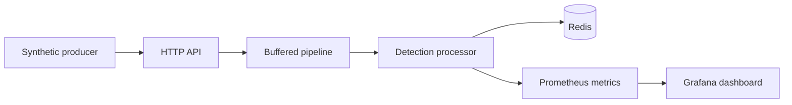

# LoginValidator Architecture

LoginValidator is designed as a small async ingestion and detection pipeline:

## Why the pipeline is asynchronous

The HTTP API should stay fast and predictable. It only validates the request and tries to enqueue the event.

- Accepted auth events are handed off to the pipeline and processed by workers.
- The pipeline uses a buffered channel sized for burst absorption.
- Workers consume from that channel concurrently, which keeps detection off the request path.

This gives the API a simple contract:

- malformed requests are rejected immediately
- valid events are accepted quickly
- overloaded buffers return `429 Too Many Requests`

## Why Redis is the state store

The detection rules need short-lived, per-window state. Redis is a good fit because it provides simple atomic primitives and TTL-based expiration.

The project uses:

- Redis hashes to store the raw event record by `event_id`
- Redis sets for distinct-value counting
- Redis counters for simple attempt totals
- TTLs so each rule naturally expires state when its window ends

Rule mapping:

- `rapid_successful_login` uses a set keyed by `successful_login:<user_id>` to track distinct source IPs for one user.
- `bruteforce_login_short` and `bruteforce_login_long` use counters keyed by rule name plus source IP.
- `credential_stuffing` uses a set keyed by `ip_targets:<source_ip>` to track distinct users targeted by one IP.

## Why `202 Accepted`

The API returns `202 Accepted` for valid auth events because ingestion and detection are separated.

That choice means:

- the request thread does not wait for Redis lookups and rule evaluation
- clients get a quick acknowledgement that the event was queued
- detection can continue even if downstream work takes longer than the request should

Non-auth events are also accepted with `202` and ignored by the detection pipeline. They are still counted as API traffic.

## How overload is handled

The pipeline is bounded. When the buffer is full:

- the API returns `429 Too Many Requests`
- the event is not enqueued
- queue depth is observable through Prometheus

That makes backpressure visible instead of hiding it.

## Observability

The project exposes metrics for:

- ingest request outcomes
- queue depth
- detection totals per rule
- processor timing
- internal Redis/system errors

That gives a reviewer a clear way to verify the system is working under load and that the backpressure behavior is intentional.
